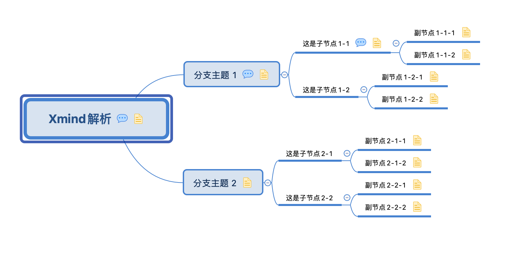

# xmindparser-java
- xmind解析为json，对象，
- 支持新版xmindzen，旧版xmind8
- 支持旧版中xml的comments批注转换
- 代码简单易使用
- 剔除多余节点，简化Notes节点，title节点


## 使用例子
- 传入一个文件路径，返回的即为组合后的json字符串
```
    //传入一个文件路径，返回的即为组合后的json字符串
  String fileName = "doc/Xmind8解析.xmind";
  String res = XmindParser.parseJson(fileName);
```
- 返回的是java对象JsonRootBean
```
  System.out.println(res);
  Object root = XmindParser.parseObject(fileName);
  System.out.println(root);
```


## 引用的包
1.  commons-compress,用于解压xmind
2.  dom4j，用于解析xml
3.  jaxen，用于支持dom4j的xpath方法

## 如何使用
pom.xml加上
```
<dependency>
    <groupId>com.github.liufree</groupId>
    <artifactId>xmindparser-java</artifactId>
    <version>1.0.0</version>
</dependency>
```
## 或者
1. clone本项目
2. 编译
```
mvn clean install
```
3. 其他项目pom.xml文件中加上依赖
```
<dependency>
    <groupId>com.github.liufree</groupId>
    <artifactId>xmindparser-java</artifactId>
    <version>1.0.0</version>
</dependency>
```

## 脑图截图

    
## 返回结果
该json格式对应的java实体为JsonRootBean
```
{
  "id": "7tbab3gajrm5omk2bjpnn5rg6c",
  "rootTopic": {
    "children": {
      "attached": [
        {
          "children": {
            "attached": [
              {
                "children": {
                  "attached": [
                    {
                      "id": "486gea2lkepjftufs5ucsj30at",
                      "notes": {},
                      "title": "副节点1-1-1"
                    },
                    {
                      "id": "615ke33sn1e1nfu75e9hturvar",
                      "notes": {},
                      "title": "副节点1-1-2"
                    }
                  ]
                },
                "comments": [
                  {
                    "author": "liufree",
                    "content": "这是子节点的批注1",
                    "creationTime": 1585017704129
                  }
                ],
                "id": "5u623rm93mi907r9bojjvsiqph",
                "notes": {},
                "title": "这是子节点1-1"
              },
              {
                "children": {
                  "attached": [
                    {
                      "id": "2aui1mrbei3eoesjfqf2p3vne1",
                      "notes": {},
                      "title": "副节点1-2-1"
                    },
                    {
                      "id": "3vsh5sfsr6ns7eht47dpdqnutv",
                      "notes": {},
                      "title": "副节点1-2-2"
                    }
                  ]
                },
                "id": "58u0a29r0esh2j29l5fhbdt9ob",
                "title": "这是子节点1-2"
              }
            ]
          },
          "comments": [
            {
              "author": "liufree",
              "content": "这是分支1的第二个批注",
              "creationTime": 1585017615931
            },
            {
              "author": "liufree",
              "content": "这是分支1的批注",
              "creationTime": 1585017601813
            }
          ],
          "id": "27qr9qed04su0tgsdrgpd87n1n",
          "notes": {},
          "title": "分支主题 1"
        },
        {
          "children": {
            "attached": [
              {
                "children": {
                  "attached": [
                    {
                      "id": "58kbocm2hfs1b3jvoaus0ma5ap",
                      "notes": {},
                      "title": "副节点2-1-1"
                    },
                    {
                      "id": "3s6kj9bdeubnal2rk47lb68vth",
                      "notes": {},
                      "title": "副节点2-1-2"
                    }
                  ]
                },
                "id": "2rq031bime76fb72c86rqng9lq",
                "title": "这是子节点2-1"
              },
              {
                "children": {
                  "attached": [
                    {
                      "id": "4n02cgqn97qie1lhvlpep56n0u",
                      "notes": {},
                      "title": "副节点2-2-1"
                    },
                    {
                      "id": "2u4lt0rmrmt1pelcklbbqigkai",
                      "notes": {},
                      "title": "副节点2-2-2"
                    }
                  ]
                },
                "id": "4v9vd02kr9ki6rf9mflqdor9o1",
                "title": "这是子节点2-2"
              }
            ]
          },
          "id": "0qrue1fta8upklu34o4evistun",
          "notes": {},
          "title": "分支主题 2"
        }
      ]
    },
    "comments": [
      {
        "author": "liufree",
        "content": "这是批注1",
        "creationTime": 1585017658526
      },
      {
        "author": "liufree",
        "content": "这是批注二",
        "creationTime": 1585017665930
      }
    ],
    "id": "5hp67g1inn9f8qibs8mjjusncl",
    "notes": {},
    "title": "Xmind解析"
  },
  "title": "画布 1"
}

```

## 结语
嗯，有那个味了，继续加油，化知识为力量